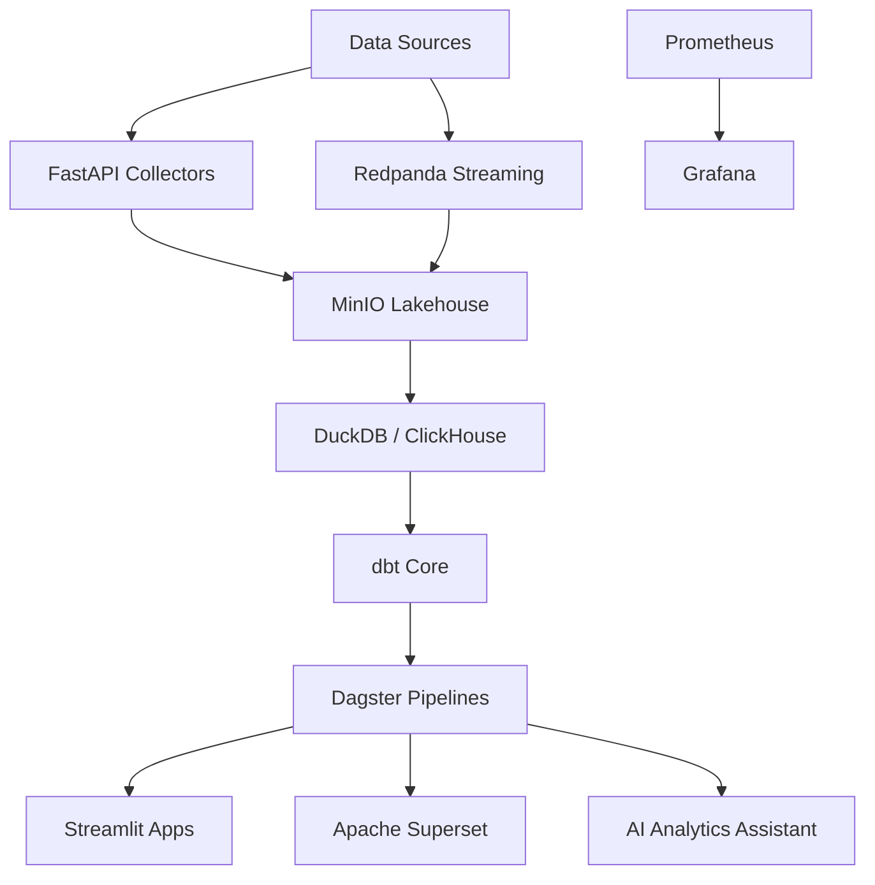

# Open Source Modern Analytics Platform

## Vision

- Batch + streaming ingestion
- Lakehouse architecture
- AI-powered analytics
- Self-service BI
- Open-source stack only

## Architecture



## Repository Structure

```text
apps/
  streamlit/
  ai-assistant/
  api/
pipelines/
  dagster/
  dbt/
  ingestion/
infrastructure/
  docker/
  monitoring/
  configs/
storage/
  raw/
  clean/
  curated/
docs/
  architecture/
  adr/
  diagrams/
```

## Week 1: Docker Compose + MinIO + DuckDB

Local services are defined in `docker-compose.yml`.

```powershell
Copy-Item .env.example .env
docker compose up -d minio minio-init
docker compose --profile tools run --rm duckdb-smoke
```

- MinIO API: <http://localhost:9000>
- MinIO Console: <http://localhost:9001>
- DuckDB smoke test: `infrastructure/docker/duckdb_smoke.py`

## Week 2: FastAPI Ingestion Services

The ingestion API accepts JSON payloads and writes them to MinIO under the raw layer.

```powershell
docker compose up -d ingestion-api
Invoke-RestMethod `
  -Method Post `
  -Uri http://localhost:8000/ingest/demo `
  -ContentType application/json `
  -Body '{"event":"signup","user_id":123}'
```

- Health check: <http://localhost:8000/health>
- Raw object path: `lakehouse/raw/{source}/YYYY/MM/DD/{uuid}.json`

## Week 3: dbt Transformations

dbt runs against DuckDB and models the first local transformation path.

```powershell
docker compose --profile tools run --rm dbt seed
docker compose --profile tools run --rm dbt run
docker compose --profile tools run --rm dbt test
```

- Raw seed: `raw.source_events`
- Clean model: `clean.events`
- Curated model: `curated.event_counts_by_day`

## Week 4: Dagster Orchestration

Dagster runs the local analytics pipeline as a repeatable job.

```powershell
docker compose --profile tools run --rm dagster `
  dagster job execute `
  -f /workspace/pipelines/dagster/definitions.py `
  -j analytics_pipeline
```

To use the Dagster UI:

```powershell
docker compose --profile orchestration up -d dagster
```

- Dagster UI: <http://localhost:3000>
- Job: `analytics_pipeline`

## Dashboards

Streamlit reads from DuckDB curated models.

```powershell
docker compose --profile dashboards up -d streamlit
```

- Streamlit UI: <http://localhost:8501>
- Source table: `curated.event_counts_by_day`

## MVP Roadmap

- Week 1: Docker Compose + MinIO + DuckDB
- Week 2: FastAPI ingestion services
- Week 3: dbt transformations
- Week 4: Dagster orchestration
- Week 5: Streamlit dashboards
- Week 6: Superset integration
- Week 7: Monitoring with Grafana
- Week 8: AI analytics assistant
