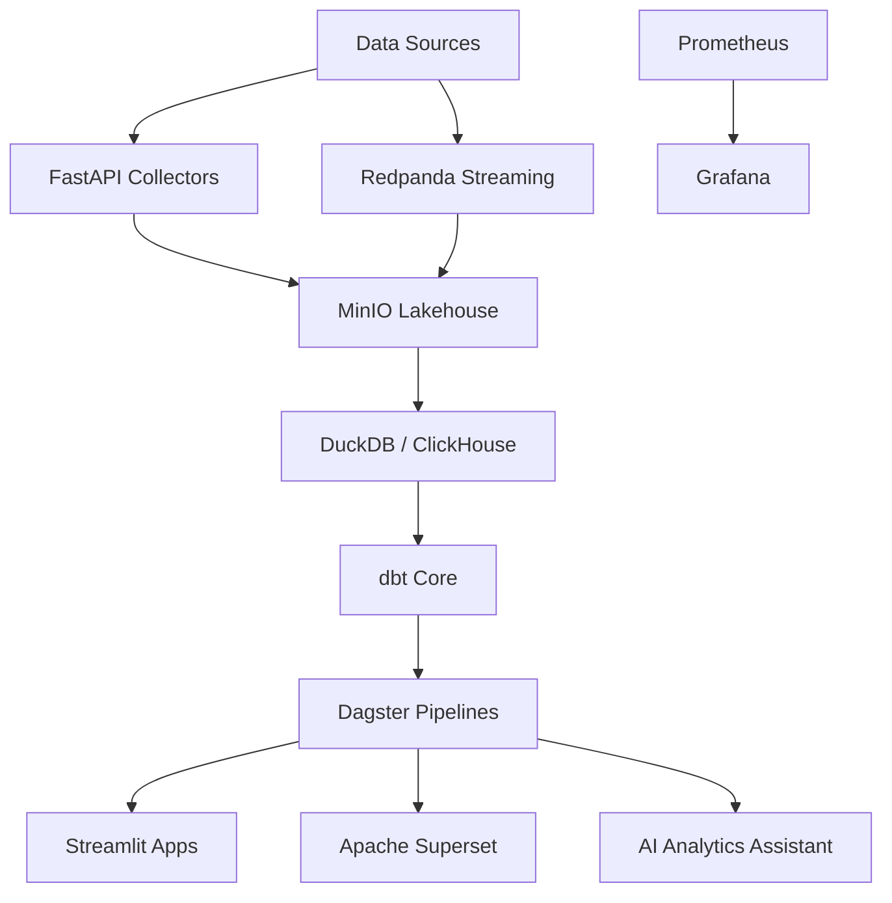

# Open Source Modern Analytics Platform

## Architecture



## Repository Structure

```text
apps/
  streamlit/
  ai-assistant/
  api/
pipelines/
  dagster/
  dbt/
  ingestion/
infrastructure/
  docker/
  monitoring/
  configs/
storage/
  bronze/
  silver/
  gold/
docs/
  architecture/
  adr/
  diagrams/
```

