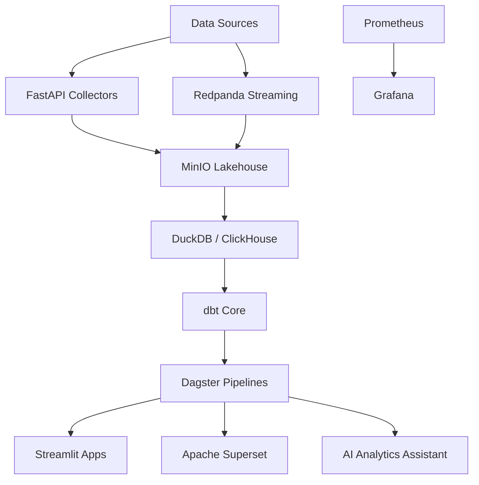

# Open Source Modern Analytics Platform

## Vision

- Batch + streaming ingestion
- Lakehouse architecture
- AI-powered analytics
- Self-service BI
- Open-source stack only

## Architecture



## Repository Structure

```text
apps/
  streamlit/
  ai-assistant/
  api/
pipelines/
  dagster/
  dbt/
  ingestion/
infrastructure/
  docker/
  monitoring/
  configs/
storage/
  raw/
  clean/
  curated/
docs/
  architecture/
  adr/
  diagrams/
```

## Week 1: Docker Compose + MinIO + DuckDB

Local services are defined in `docker-compose.yml`.

```powershell
Copy-Item .env.example .env
docker compose up -d minio minio-init
docker compose --profile tools run --rm duckdb-smoke
```

- MinIO API: <http://localhost:9000>
- MinIO Console: <http://localhost:9001>
- DuckDB smoke test: `infrastructure/docker/duckdb_smoke.py`

## MVP Roadmap

- Week 1: Docker Compose + MinIO + DuckDB
- Week 2: FastAPI ingestion services
- Week 3: dbt transformations
- Week 4: Dagster orchestration
- Week 5: Streamlit dashboards
- Week 6: Superset integration
- Week 7: Monitoring with Grafana
- Week 8: AI analytics assistant
